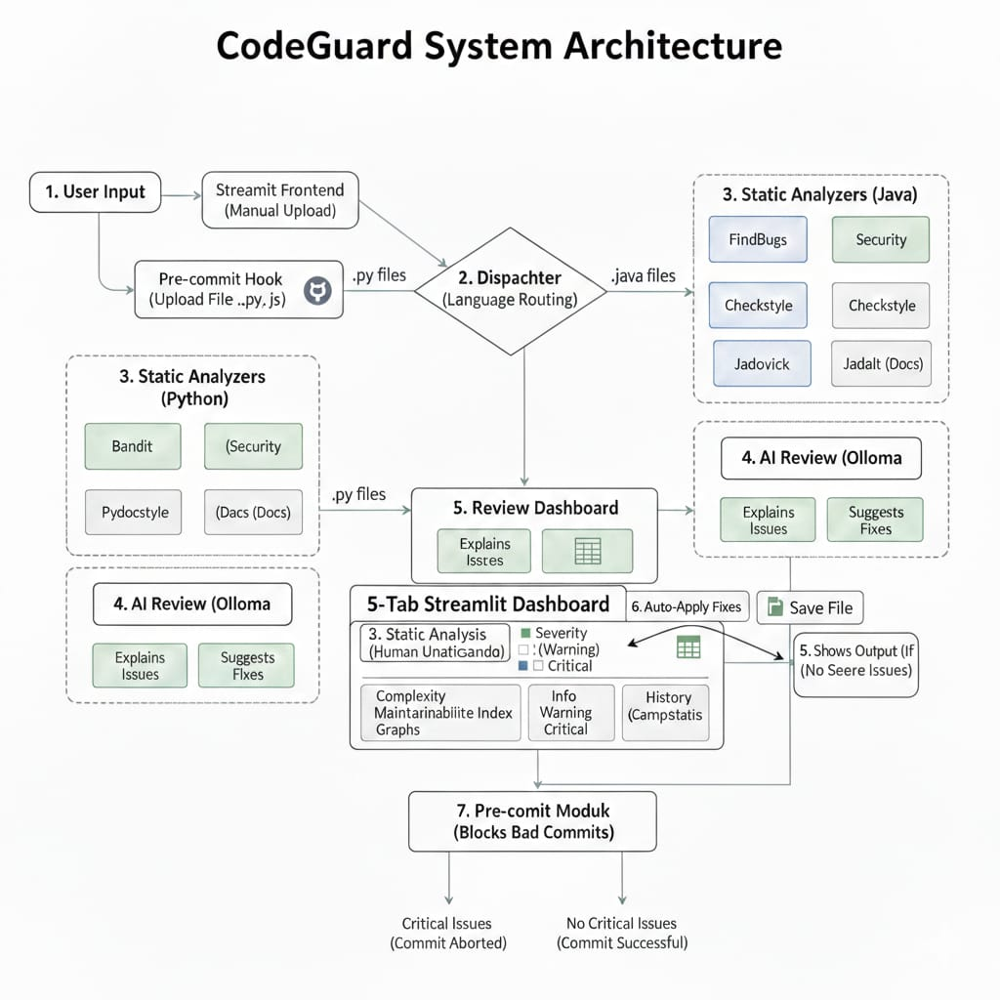

# CodeGuard - Multi-Language Code Quality Analyzer 🛡️

---

## Overview

CodeGuard is an AI-powered, modular code quality analyzer designed to detect style violations, documentation gaps, security risks, and complexity issues across multiple programming languages.

It integrates Ollama AI to generate intelligent explanations and automatic fix suggestions.

The system includes:
- Streamlit-based interactive dashboard  
- Pre-commit hook for commit-level quality enforcement  
- Reporting and metrics engine  
- Multi-language static analysis  

---

## Key Features

- Static analysis for Python, C, C++, Java, JavaScript
- AI-powered review with explanation and fix suggestions
- Code metrics (complexity, documentation coverage, etc.)
- Streamlit dashboard with:
  - Static Issues
  - AI Review
  - Metrics
  - Program Output
- Pre-commit hook to block CRITICAL/ERROR commits
- Demo files for testing (error vs clean)

---

## System Architecture

  

---

## Project Structure

.github/           → GitHub Actions workflows  
.gitlab/           → GitLab CI/CD config  

analyzers/         → Language-specific analyzers  
    c_analyzer.py  
    cpp_analyzer.py  
    java_analyzer.py  
    javascript_analyzer.py  

codeguard/         → Core engine  
    module1.py (static analysis)  
    module2.py (AI integration - Ollama)  
    module3.py (reporting & metrics)  
    dispatcher.py (language routing)  
    analyzer.py  
    __main__.py (CLI entry point)  

uploaded_files/    → Demo files  

streamlit_app.py   → Streamlit frontend  
pyproject.toml     → Project configuration  
README.md          → Documentation  

---

## Installation

Clone repository:

git clone https://github.com/<your-username>/CodeGuard.git  
cd CodeGuard  

Install dependencies:

pip install -r requirements.txt  

---

## Usage

Run via CLI:

python -m codeguard uploaded_files/error.py  

Launch Streamlit Dashboard:

streamlit run streamlit_app.py  

Open in browser:

http://localhost:8501  

---

## Workflow

User Input  
↓  
Dispatcher  
↓  
Static Analyzers  
↓  
AI Review (Ollama)  
↓  
Metrics & Reporting  
↓  
Streamlit UI  
↓  
Pre-commit Validation  

---

## Language Support

Implemented:
- Python
- C
- C++
- Java
- JavaScript

Planned:
- TypeScript
- Kotlin
- Go
- Rust
- PHP
- HTML/CSS
- Shell
- Ruby

---

## Author

Developed by Mahitha Chippada  
AI & Data Science Student  
Building AI-driven Developer Tools
